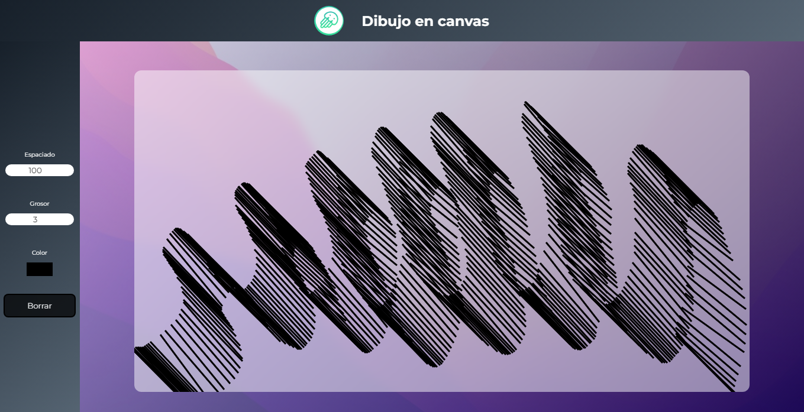

<h1 align="center">Paint-Canvas</h1>

Simple interactive whiteboard made with canvas

:link: Paint-Canvas https://eddybel.github.io/Paint-Canvas/

# WHY ?

This project is a practice to understand how canvas works and the interaction with the user. It is still under development since the type of drawing with the mouse must be improved

# Proyect view

---

---

---

# Technologies

- JavaScript
- CSS
- HTML
